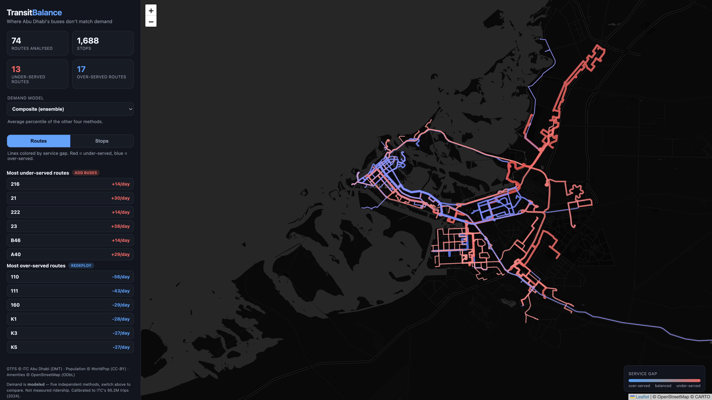
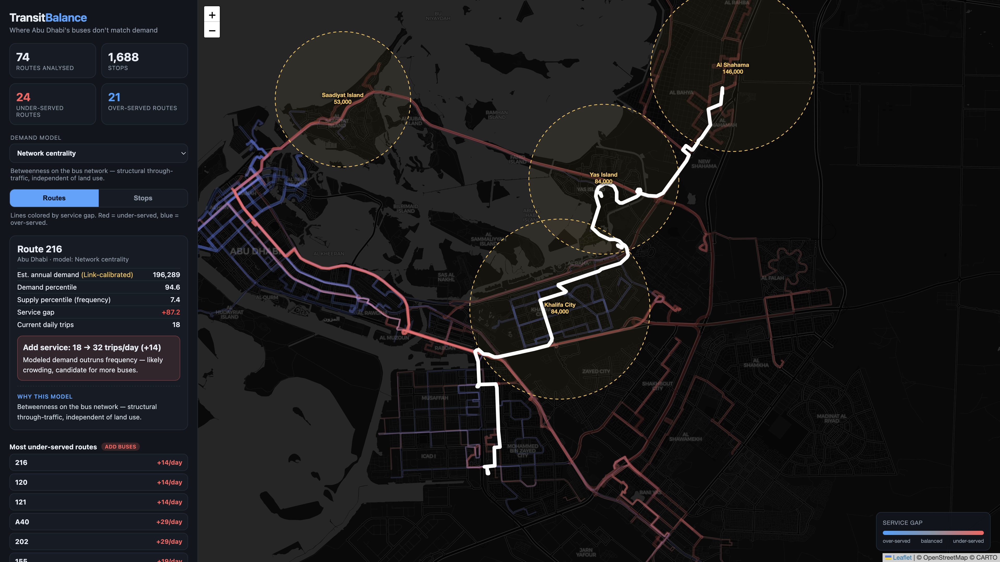
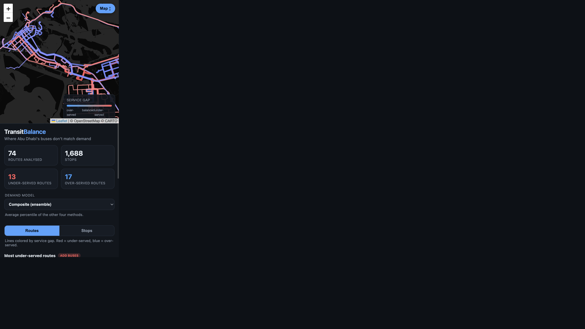
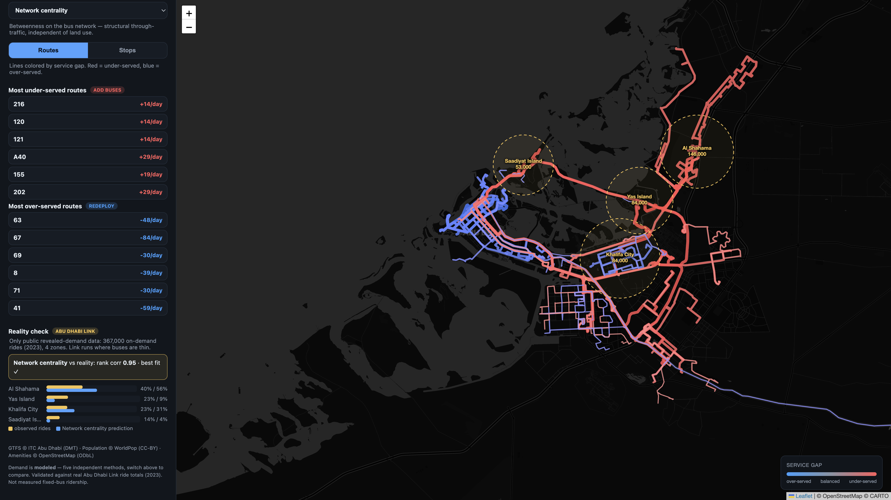

# Transit Balance — Abu Dhabi Bus Demand vs. Allocation

> Where do Abu Dhabi's buses **not** match demand — and how should service be rebalanced?

Built for the **Cursor × eVoost Abu Dhabi AI PropTech Challenge** (Future Communities / Decision Intelligence).

Abu Dhabi publishes its bus network (GTFS) but **no per-stop ridership**. So Transit Balance
**estimates demand five different ways**, lets you switch between them live, and — crucially —
**calibrates and scores every model against the only public revealed-demand data that exists:
real Abu Dhabi Link on-demand ride totals.**



---

## What it does

An interactive map of the whole Abu Dhabi bus network where every route and stop is colored by
its **service gap** = `demand percentile − supply percentile`:

- 🔴 **red = under-served** (high demand, low frequency → add buses)
- 🔵 **blue = over-served** (low demand, high frequency → redeploy)

Click any route or stop for its **Link-calibrated annual demand**, demand vs. supply percentiles,
and a concrete **trips/day recommendation**.

| Route detail (Network centrality model) | Mobile |
|---|---|
|  |  |

## The idea: don't trust one demand model — compare five

Because demand can't be measured directly, the app ships **five independent estimators** and a
dropdown to switch between them. Each is principled and standalone (none is fitted to the answer):

| Model | What it captures | Basis |
|---|---|---|
| **Residents** | trip origins | WorldPop population within 500 m of each stop |
| **Destinations** | trip attraction | OSM trip generators (schools, malls, clinics…) within 500 m |
| **Gravity** | accessibility | Σ reachable activity with distance decay (≤ 2.5 km) |
| **Network centrality** | structural through-traffic | Betweenness on the bus-stop graph — *land-use independent* |
| **Composite** | ensemble | mean percentile of the four above |

## The differentiator: a real-data reality check

Abu Dhabi **Link** is the on-demand feeder that runs *where fixed buses are thin*, so its public
zone-level ride totals are a genuine **revealed-demand proxy**. The app:

1. **Validates** each model against real 2023 Link rides (Spearman/Pearson rank correlation), and
2. **Calibrates** demand to those rides via least-squares, so route/stop demand is reported in
   **real Link-anchored annual rides**, not an abstract index.



**Result — out-of-sample fit vs. real Link rides:**

| Model | Rank corr |
|---|---|
| **Network centrality** | **+0.95** ✓ best |
| Residents | +0.63 |
| Composite | +0.63 |
| Gravity | +0.63 |
| Destinations | +0.32 |

> **Finding:** a structural, land-use-independent signal (where a stop sits in the network)
> predicts Abu Dhabi demand far better than who lives or what's built nearby.

Real Link ride totals used as anchors (2023): Al Shahama 146k · Yas Island 84k ·
Khalifa City 84k · Saadiyat 53k (367k total). Sources: ITC 2022 release; AD Media Office 2023.

## Run locally

```bash
pip install -r requirements.txt

python3 scripts/download_data.py           # 1. pull real sources -> data/raw/ (GTFS, WorldPop, HRSL)
python3 scripts/build_model.py             # 2. demand models + Link calibration -> webapp/data/*
python3 -m http.server 8765 -d webapp      # 3. open http://localhost:8765
```

The committed `webapp/data/` is precomputed, so you can skip straight to step 3 to see the demo.
`scripts/compare_demand_sources.py` (optional) reproduces the demand-source quality comparison;
`scripts/ai_brief.py` (optional, needs `OPENAI_API_KEY`) adds per-route LLM briefings.

## Deploy (static — Cloudflare Pages)

The app is **100% static** (Leaflet + precomputed GeoJSON/JSON, all relative paths). No backend,
no build step.

```bash
npx wrangler pages deploy webapp --project-name transit-balance
```

Or via the Cloudflare dashboard (Git integration):
**Build command:** *(empty)* · **Build output directory:** `webapp` · **Framework preset:** None.

Works identically on Vercel / Netlify / GitHub Pages — just publish `webapp/`.

## Data sources

| Source | What it provides | License / attribution |
|---|---|---|
| **ITC Abu Dhabi GTFS** (DMT) | Network: routes, stops, trips. `trips/stop` = current allocation | © ITC Abu Dhabi (DMT) |
| **Abu Dhabi Link ride totals** (2022–23) | Real on-demand ridership by zone — revealed-demand anchor | ITC / AD Media Office (public) |
| **WorldPop 2025 100m** | Modeled population grid (demand origins) | CC-BY 4.0 © WorldPop, Univ. of Southampton |
| **Meta HRSL 2020** | High-res population + age bands | CC-BY © Meta Data for Good / CIESIN |
| **OSM amenities** | Trip generators (demand destinations) | © OpenStreetMap contributors, ODbL |

## How the gap is computed

For every stop, each model produces a demand score; we percentile-rank it and subtract the
percentile of GTFS service frequency (supply). Routes aggregate the **sum** of their stops'
calibrated demand (so total ridership potential, not an average that penalizes long routes).
A route's recommended trips/day scales its current frequency toward the network-median load.

## Caveats & next steps

- Calibration is anchored on only **4 zones / annual totals**, so it nails the high-demand
  mainland zones (Shahama, Khalifa City) but **underweights the two islands** (few stops).
- Demand is **modeled**, not measured fixed-bus ridership — directional, not operational truth.
- **Next:** a formal aggregated **hourly + origin-destination** dataset via ITC / Bayanat / SCAD
  would let the same validation/calibration harness add **time-of-day and day-of-week** demand and
  tighten the island estimates dramatically.

## Project layout

```
webapp/            static site (deploy this) — index.html, app.js, style.css, data/
scripts/           build pipeline — download_data, build_model, compare_demand_sources, ai_brief
data/raw/          downloaded sources (gitignored; regenerate via download_data.py)
docs/img/          screenshots
```
